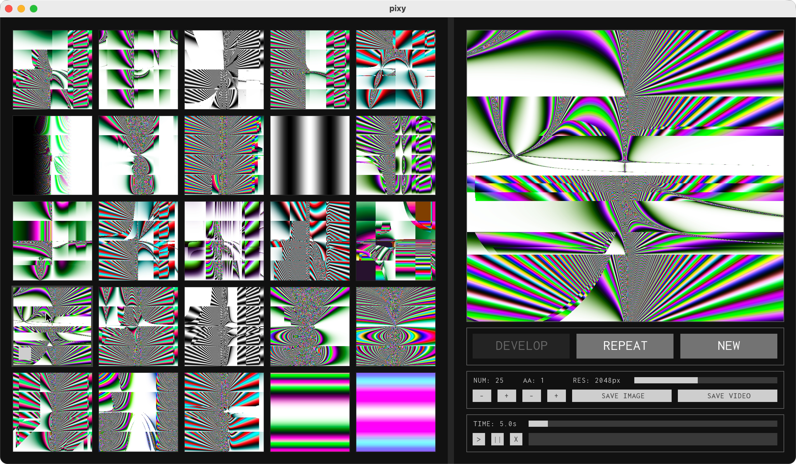
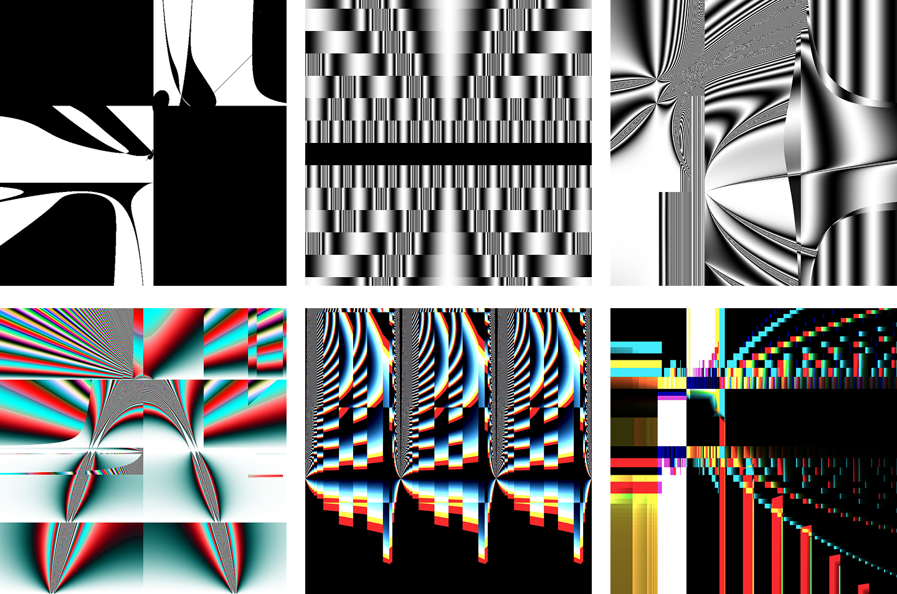
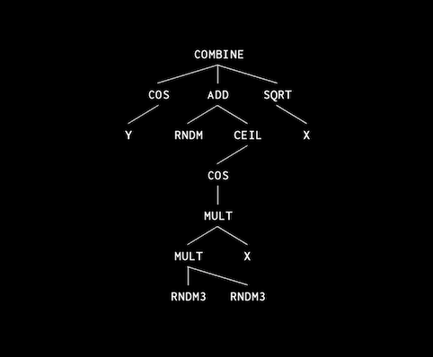

# Pixy
**Evolutionary shaders in Processing**

 

Pixy is an evolutionary system for generating images and animations from mathematical functions through guided selection. Images are constructed by passing pixel `x` `y` coordinates as function inputs, and returning `rgb` pixel colors as outputs. Functions are constructed as random expression trees, which are evolved and mixed with user guidance.

 

 

## How it works

Pixy manages a population of images, each with its own DNA and shader. The DNA is an expression tree: its leaves provide coordinates or random constants, while function nodes combine them through arithmetic, trigonometry, logic, color and noise operations. User selection determines parents for the next generation. Mutation changes values, functions, and branches. Combining parents exchanges branches between their trees. Each tree is compiled into a GLSL expression and inserted into a fragment shader template.

## Getting started

- Download and install [Processing](https://processing.org/download/).
- Download and extract this repository.
- Open `pixy/pixy.pde` in Processing's **Java mode** and click **Run**.

ControlP5 is bundled; no separate library installation is required.

The current sketch has been tested with Processing 4.5.6 on macOS 26.6.2.

## Evolving images

- Click **NEW** to generate a random population.
- Select images for evolution with the corner button.
- Click **DEVELOP** to generate new variations from the selected images.
- Use **Cmd/Ctrl-click** or hover and press **Space** to evolve an image together with the current selection.
- Click **REPEAT** to generate another population from the last selection.
- Use **NUM + / −** to increase or decrease population size.

## Inspecting an image

- Click an image in the grid to inspect it.
- Drag the canvas or use the arrow keys to pan; press **a / z** to zoom.
- The graph view represents the expression tree of the selected image.

## Animation

- Click **>** to enable animation.
- Set loop duration and animation speed with the **TIME** slider.

Video exports render one loop at 60 fps. Default export resolution is 2048 × 2048 px, adjustable with **RES**.

## Export

- Open or select the image to choose it for export.
- Use **AA + / −** to adjust image smoothness (antialiasing).
- Click **SAVE IMAGE** to save it as JPEG, or press **s** to save the focused image.
- Click **SAVE VIDEO** to render as H.264 MOV if [FFmpeg](https://ffmpeg.org/download.html) is installed, otherwise as JPEG sequence.

Exports are saved to `outputs/` next to the `pixy/` folder.

## Customizing generation

Pixy chooses functions for generation and mutation using relative weights in range [0-1]. 
Edit `genesMethodsGroupRate` in [genes.pde](pixy/genes.pde) to adjust function group weights. Edit the arrays below to adjust function weights within each group:

| Group | Functions |
| --- | --- |
| `genesBasicMathRate` | `add` `sub` `mult` `div` |
| `genesExponentialRate` | `pow2` `sqrt` `powOf` `logOf` `2pow` `2log` |
| `genesRoundRate` | `mod` `fract` `floor` `ceil` `round` |
| `genesTrigRate` | `sin` `cos` `tan` `asin` `acos` `atan` |
| `genesConstrainRate` | `min` `max` `clamp` `abs` |
| `genesMixRate` | `mix` |
| `genesLogicRate` | `if` `and` `or` `xor` |
| `genesElseRate` | `hsb2rgb` `combine` `setH` `setS` `setV` `noise2` |

## Inspiration

The project was heavily inspired by Karl Sims's work on evolving images through user selection, particularly the use of symbolic expressions that can be mutated and combined.

Sims, Karl. 1991. [*Artificial Evolution for Computer Graphics*](https://www.karlsims.com/papers/SimsSiggraph91.pdf). *Computer Graphics*, 25(4), 319–328. ACM SIGGRAPH '91 Conference Proceedings.

## About

Pixy was my first generative application and my first encounter with shaders, made in 2017 as a university project. Updated for release in 2026.

[༺ཧคlคฝคཊ༻](https://rybinfx.com)

## License and credits

Pixy is released under the [MIT License](LICENSE). You may use, modify, and distribute the code, including commercially, provided you retain the copyright and license notices. The software is provided “as is”, without warranty.

Bundled libraries and fonts retain their own licenses:

ControlP5 by Andreas Schlegel: [LGPL 2.1 or later](pixy/third-party/controlP5/LICENSE.md). [Bundled library source and attribution](pixy/third-party/controlP5/README.md).

Inconsolata by the Inconsolata Project Authors: [SIL Open Font License 1.1](pixy/third-party/Inconsolata/OFL.txt). [Bundled font source and attribution](pixy/third-party/Inconsolata/README.md).
